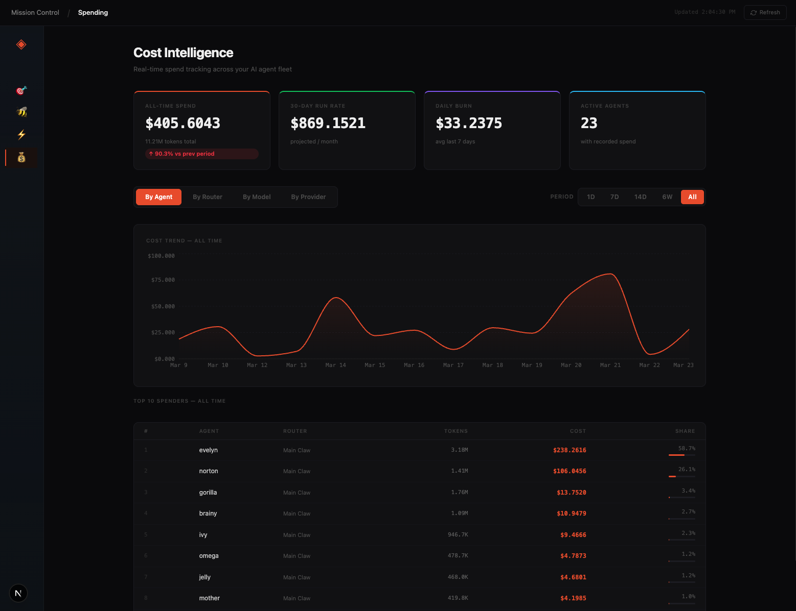
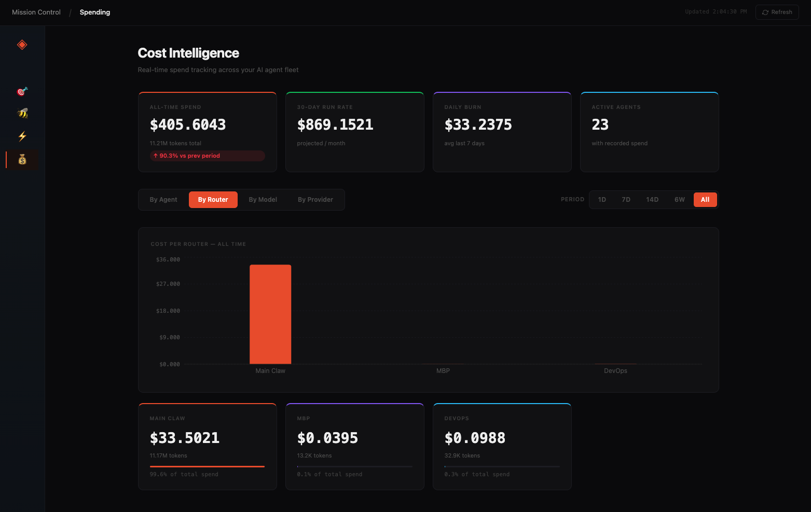

# Mission Control for Agents

> The spatial operating system for your OpenClaw agent swarms.






Mission Control is a Next.js dashboard for visualizing, navigating, and managing autonomous [OpenClaw](https://github.com/openclaw/openclaw) agent swarms. Connect multiple gateways at once — each one gets its own cluster on the canvas, with orchestrators and specialists laid out in hierarchy. The dashboard can be hosted anywhere; a lightweight **Router** bridges each OpenClaw instance over HTTP.

## Architecture

```
┌─────────────────────────┐         ┌──────────────────────────────┐
│   Your Machine (local)  │         │  Mission Control (anywhere)   │
│                         │  HTTP   │                               │
│  OpenClaw  ←→  Router ──┼─────────┼──→  Dashboard (Next.js)      │
│            (port 3010)  │         │         (port 3000)           │
└─────────────────────────┘         └──────────────────────────────┘
```

- **Router** runs on the same machine as OpenClaw. It bridges OpenClaw's localhost-only API and exposes a simple REST API secured by a bearer token.
- **Mission Control** (this app) can run anywhere. It connects to one or more routers over HTTP.

---

## Installation

### Prerequisites

- Node.js 20+
- An OpenClaw gateway running with a valid bearer token

### 1. Clone and install

```bash
git clone https://github.com/ykbryan/mission-control-for-agents.git
cd mission-control-for-agents
npm install
cd router && npm install && cd ..
```

### 2. Configure the router

```bash
cp router/.env.example router/.env
```

Edit `router/.env`:

```env
OPENCLAW_URL=http://127.0.0.1:18789   # your OpenClaw gateway URL
OPENCLAW_TOKEN=your_openclaw_token    # your OpenClaw bearer token
ROUTER_PORT=3010
# ROUTER_TOKEN=                       # leave blank to auto-generate
```

### 3. Start both together

```bash
npm run dev:local
```

This starts the router (port 3010) and the dashboard (port 3000) simultaneously.

The router terminal will print its URL and token:

```
  🛰  Mission Control Router  v1.2.0

  Listening   http://localhost:3010
  OpenClaw    http://127.0.0.1:18789

  ────────────────────────────────────────
  In Mission Control, add this router:
  ────────────────────────────────────────

  Router URL  http://localhost:3010
  Token       abc123def456...
```

### 4. Log in

Open `http://localhost:3000`. Enter the **Router URL** and **Token** printed above.

---

## Upgrade

### Dashboard

```bash
git pull
npm install
npm run build   # production
# or: npm run dev:local   # development
```

### Router (remote machines)

The quickest way to upgrade a router on a remote machine — including machines that originally deployed via the one-liner:

```bash
curl -fsSL https://raw.githubusercontent.com/ykbryan/mission-control-for-agents/main/update-router.sh \
  -o /tmp/update-router.sh && bash /tmp/update-router.sh
```

This script:
1. Pulls the latest router source from GitHub
2. Rebuilds the TypeScript
3. Restarts the running router process (PM2 or node)
4. Preserves your `.env` and existing `.router-token`

To upgrade manually:

```bash
cd /path/to/mission-control-for-agents
git pull
cd router && npm install && npm run build && cd ..
# restart your process manager, e.g.:
pm2 restart router
```

---

## Multiple Routers

Monitor several OpenClaw instances from a single hosted dashboard.

```
┌──────────────────────┐
│  VPS A               │
│  OpenClaw ↔ Router A ├────────────┐
│  (port 3010)         │            │    ┌─────────────────────────┐
└──────────────────────┘            ├────┤  Mission Control        │
                                    │    │  (hosted anywhere)      │
┌──────────────────────┐            │    └─────────────────────────┘
│  VPS B               │            │
│  OpenClaw ↔ Router B ├────────────┘
│  (port 3010)         │
└──────────────────────┘
```

### Deploy a router on each machine

```bash
git clone https://github.com/ykbryan/mission-control-for-agents.git
cd mission-control-for-agents/router
npm install
cp .env.example .env
# Edit .env with this machine's OPENCLAW_URL and OPENCLAW_TOKEN
npm start
```

Note the token printed on startup, then open port 3010 in your firewall.

> **Security tip:** Put the router behind a reverse proxy with HTTPS (e.g. Nginx + Let's Encrypt or Cloudflare Tunnel) before exposing it to the internet.

### Connect from Mission Control

Open **Connections** in the sidebar and add each router's URL + token. All connected routers appear as separate gateway clusters on the canvas.

---

## Features

### Agent Canvas
Interactive node map built on React Flow. Orchestrators and specialists are laid out in hierarchy per gateway. Zoom, pan, and click any node to inspect. Each node shows the agent's primary AI model with a provider-colored badge.

### Agent Profile & Inspector
Double-click any node for a full-screen profile showing identity, skills/capabilities, primary model, and markdown files (SOUL.md, IDENTITY.md, SKILLS.md, etc.). Click skill chips to see descriptions.

### Activity & Logs
Live session stream built from the agent's transcript history — user messages, tool calls, model switches, and responses.

### Token & Cost Intelligence
Per-agent and per-router token consumption with estimated USD cost. Filter by time period (1D / 7D / 14D / 6W / All) across By Agent and By Router views. By Model and By Provider show all-time breakdowns.

---

## Router API Reference

All endpoints require `Authorization: Bearer <token>` except `/health`.

| Endpoint | Description |
|---|---|
| `GET /health` | Health check. Returns `{ ok, version, time, gateway }`. No auth required. |
| `GET /agents` | List all agents. Scores each agent for orchestrator vs specialist based on AGENTS.md, MEMORY.md, and inbound references. |
| `GET /sessions?agentId=` | List sessions, optionally filtered by agent. Supplements OpenClaw API with on-disk session data. |
| `GET /session?agentId=&sessionKey=` | Parsed activity events for a session (or latest session for the agent). Returns `{ agentId, events }`. |
| `GET /all-sessions` | All sessions across all agents. Each entry includes active status, session type, and context. |
| `GET /file?agentId=&name=` | Read a `.md` file from an agent's workspace directory. Blocks path traversal. |
| `GET /costs` | Token and cost analytics aggregated by agent, by date, and by model. Returns `{ costs, daily, models }`. |
| `GET /crons-native` | Native OpenClaw cron jobs from `~/.openclaw/cron/jobs.json`. |
| `GET /info` | System info for this node — hostname, platform, CPU, memory, uptime, Node.js version, router version. |
| `GET /debug` | Connectivity diagnostics. Tests HTTP access to OpenClaw and filesystem access to transcripts. |

---

## Dashboard API Reference

The Next.js app exposes these internal API routes (called by the browser, not directly by users):

| Endpoint | Description |
|---|---|
| `POST /api/auth/verify` | Verify router credentials and store in cookies. |
| `GET /api/auth/routers` | List configured routers from cookies. |
| `GET /api/agents` | Aggregate agents from all connected routers. |
| `GET /api/agent-file?agent=&file=&routerId=` | Fetch a markdown file for an agent. |
| `GET /api/agent-session?agent=&sessionKey=&routerId=` | Fetch activity events for a session. |
| `GET /api/agent-sessions?agent=&routerId=` | List recent sessions for an agent (up to 10, grouped by type). |
| `GET /api/activities` | All active sessions across all routers with label, icon, and context. |
| `GET /api/telemetry/agent-costs` | Aggregated cost data from all routers. Returns `{ costs, daily, byRouter, byModel }`. |
| `GET /api/cron-schedule` | Scheduled jobs across all routers, with inferred intervals, next run time, and validity status. |
| `GET /api/node-info` | System info for each connected router node. |

---

## Environment Variables

### Router (`router/.env`)

| Variable | Default | Description |
|---|---|---|
| `OPENCLAW_URL` | `http://127.0.0.1:18789` | OpenClaw gateway URL |
| `OPENCLAW_TOKEN` | — | OpenClaw bearer token (required) |
| `ROUTER_PORT` | `3010` | Port to listen on |
| `ROUTER_TOKEN` | auto-generated | Token for Mission Control auth. Auto-saved to `.router-token` on first run. |

### Dashboard

No `.env` file is required. Router credentials are stored as HTTP-only cookies after login.

---

## Docker

A `Dockerfile` is included for building a self-contained Mission Control image:

```bash
docker build -t mission-control .
docker run -p 3000:3000 mission-control
```

The image runs as an unprivileged user (`nextjs`, UID 1001) and respects a `PORT` environment variable at runtime.

---

## Troubleshooting

### OpenClaw not reachable from Docker

OpenClaw bound to `127.0.0.1` is not reachable from inside a Docker container. Options:

- Set `gateway.bind = "auto"` (or `"0.0.0.0"`) in `openclaw.json`, then `openclaw gateway restart`
- Use a Tailscale or VPN address instead of `127.0.0.1`

### Systemd overrides loopback binding

Some Linux installs ship a systemd service with a hardcoded `--bind loopback` flag that overrides your `openclaw.json`. Check:

```bash
systemctl cat openclaw
```

If you see `--bind loopback`, create a drop-in override:

```bash
sudo systemctl edit openclaw
# Add:
# [Service]
# ExecStart=
# ExecStart=/usr/bin/openclaw gateway --bind auto
```

### Next.js build-time fetch crash

API routes that call the router at build time will crash the build if the router isn't running. Mark those routes with:

```ts
export const dynamic = 'force-dynamic';
```

### Router token lost after restart

If you didn't set `ROUTER_TOKEN` in `.env`, the token is saved to `router/.router-token`. This file persists across restarts as long as the working directory doesn't change. Pin a stable token by adding `ROUTER_TOKEN=your_token` to `router/.env`.
