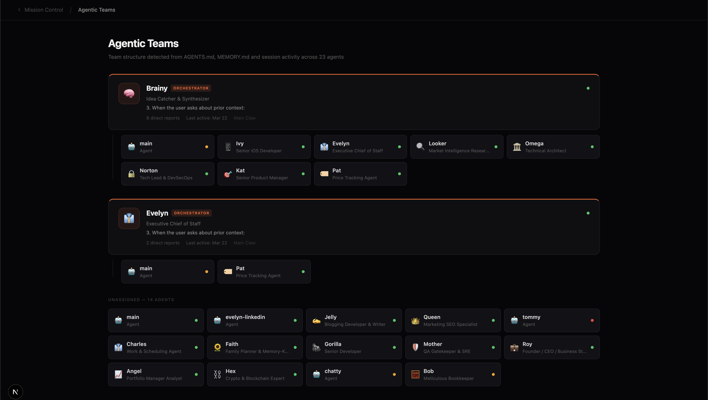
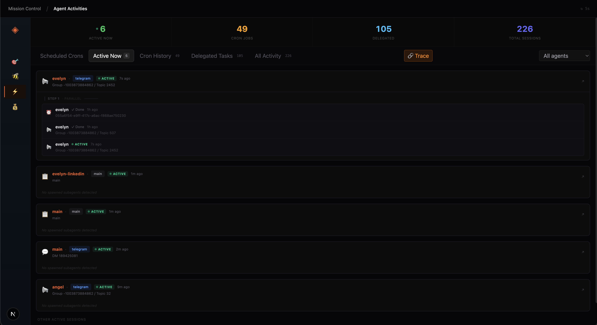
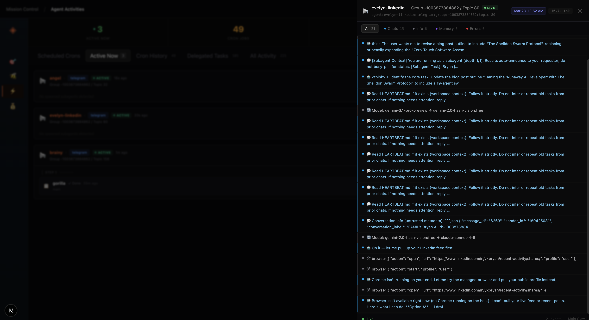
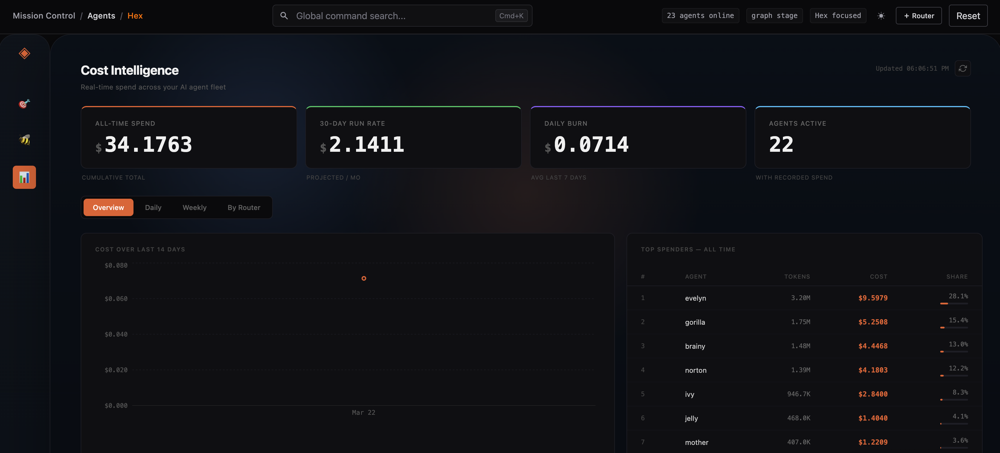
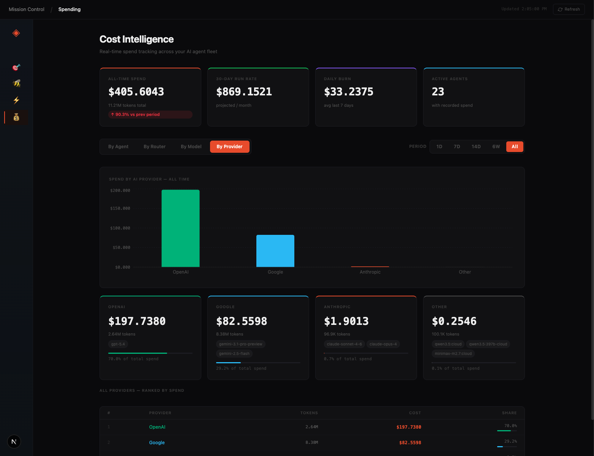
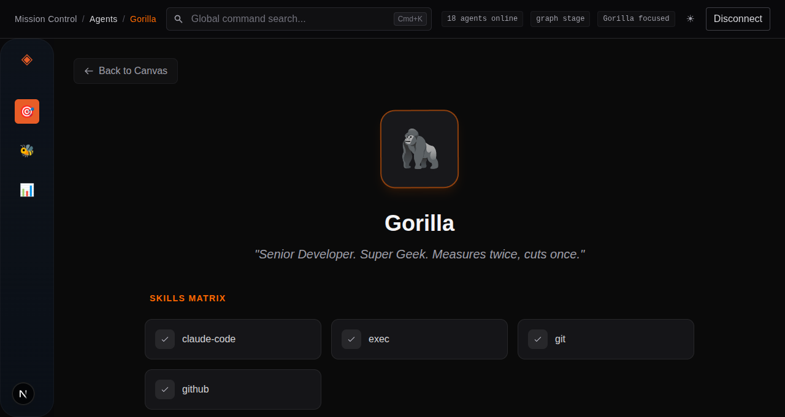
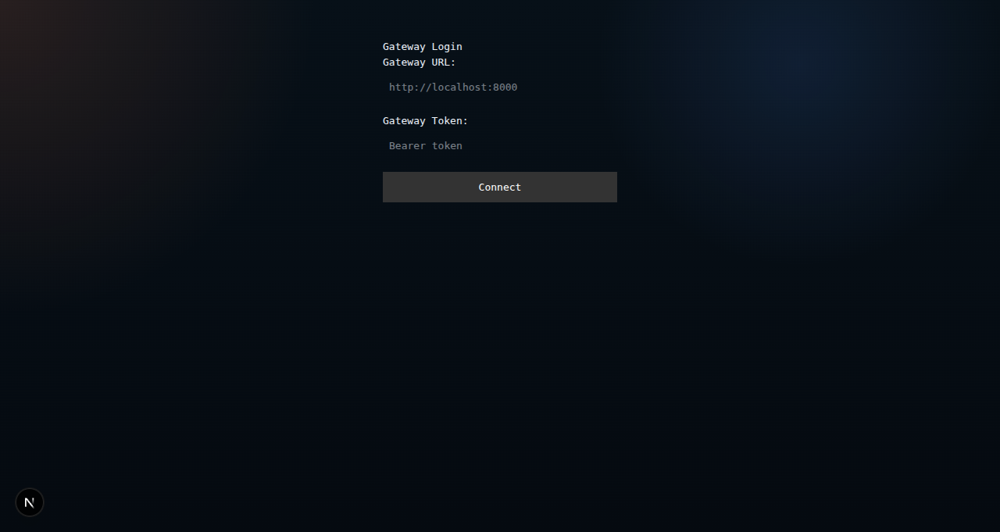

# Mission Control for Agents

A real-time dashboard to monitor, audit, and manage your AI agent fleet.


---

## Quick Start

**Install everything (Router + UI) with one command:**

```bash
curl -fsSL https://raw.githubusercontent.com/ykbryan/mission-control-for-agents/main/install.sh | bash
```

**Or install components separately:**

```bash
# Router only (run on the machine alongside OpenClaw)
curl -fsSL https://raw.githubusercontent.com/ykbryan/mission-control-for-agents/main/install-router.sh | bash

# Mission Control UI only
curl -fsSL https://raw.githubusercontent.com/ykbryan/mission-control-for-agents/main/install-missioncontrol.sh | bash
```

---

## Features

### Agent Canvas

Visualise your entire agent fleet as a live hierarchy. Click any agent card to inspect its model, capabilities, active sessions, OpenClaw files, and contextual summary in the side panel.


---

### Agentic Teams

Automatically detects orchestration relationships from `AGENTS.md` and session activity. See which agents are leads, which are delegates, and which are running solo.



---

### Live Activity Monitoring

The Active Now tab renders swarm traces in real time — showing each root agent, its delegated sub-agents, the last response, and live/done status for every node.



---

### Session Trace Log

Drill into any session to see the full message-by-message log with timestamps, token counts, tool calls, and agent-to-agent handoffs.



---

### Cost Intelligence

Track spend across every dimension. Switch between By Agent, By Router, By Model, and By Provider views with configurable time periods (1D → All time).

 

---

### Agent Profile

Deep-dive into any individual agent: full session history, token usage breakdown across Telegram groups, cron jobs, and delegated tasks — all in one view.



---

## Installation

### Full install (Router + UI)

Run the combined installer on any machine with Node 18+, npm, and git:

```bash
curl -fsSL https://raw.githubusercontent.com/ykbryan/mission-control-for-agents/main/install.sh | bash
```

The script prompts for:
- OpenClaw URL (default: `http://127.0.0.1:18789`)
- OpenClaw token
- Router port (default: `3010`)
- Mission Control port (default: `3000`)

To skip interactive prompts, set environment variables before running:

```bash
OPENCLAW_URL=http://127.0.0.1:18789 \
OPENCLAW_TOKEN=your-token-here \
ROUTER_PORT=3010 \
MC_PORT=3000 \
curl -fsSL https://raw.githubusercontent.com/ykbryan/mission-control-for-agents/main/install.sh | bash
```

After installation, open Mission Control in your browser and click **+ Router**:



Enter the Router URL and token printed at the end of the install output. The token is also saved to `<ROUTER_INSTALL_DIR>/.router-token`.

**Default install directories:**

| Component | macOS / WSL | Linux |
|---|---|---|
| Router | `~/mission-control-router` | `/opt/mission-control-router` |
| Mission Control UI | `~/mission-control-ui` | `/opt/mission-control-ui` |

Override with `ROUTER_INSTALL_DIR` and `MC_INSTALL_DIR`.

---

### Router only

Run this on the machine where OpenClaw is running:

```bash
curl -fsSL https://raw.githubusercontent.com/ykbryan/mission-control-for-agents/main/install-router.sh | bash
```

Non-interactive:

```bash
OPENCLAW_URL=http://127.0.0.1:18789 \
OPENCLAW_TOKEN=your-token-here \
ROUTER_PORT=3010 \
bash install-router.sh
```

The router URL and token are printed on completion and saved to `<INSTALL_DIR>/.env.local`.

---

### Mission Control UI only

Run this on the machine that will host the dashboard:

```bash
curl -fsSL https://raw.githubusercontent.com/ykbryan/mission-control-for-agents/main/install-missioncontrol.sh | bash
```

Non-interactive:

```bash
MC_PORT=3000 bash install-missioncontrol.sh
```

After installation, open `http://<your-ip>:3000` and add routers using **+ Router**.

---

## Updating

### Update both Router and UI

```bash
curl -fsSL https://raw.githubusercontent.com/ykbryan/mission-control-for-agents/main/update.sh | bash
```

### Update Router only

```bash
curl -fsSL https://raw.githubusercontent.com/ykbryan/mission-control-for-agents/main/update-router.sh | bash
```

### Update Mission Control UI only

```bash
curl -fsSL https://raw.githubusercontent.com/ykbryan/mission-control-for-agents/main/update-missioncontrol.sh | bash
```

All update scripts preserve your existing `.env` and `.router-token` files and restart the relevant pm2 process automatically.

---

## Configuration

| Variable | Default | Description |
|---|---|---|
| `OPENCLAW_URL` | `http://127.0.0.1:18789` | URL of the OpenClaw gateway the router connects to |
| `OPENCLAW_TOKEN` | _(required)_ | Bearer token for authenticating with OpenClaw |
| `ROUTER_PORT` | `3010` | Port the router HTTP API listens on |
| `MC_PORT` | `3000` | Port Mission Control UI listens on |
| `ROUTER_INSTALL_DIR` | `~/mission-control-router` (macOS/WSL) · `/opt/mission-control-router` (Linux) | Override the router install directory |
| `MC_INSTALL_DIR` | `~/mission-control-ui` (macOS/WSL) · `/opt/mission-control-ui` (Linux) | Override the Mission Control UI install directory |

The router reads its runtime config from `<ROUTER_INSTALL_DIR>/.env`. The Mission Control UI port is configured via the pm2 ecosystem file (`ecosystem.config.cjs`) written during installation.

---

## Architecture

```
┌─────────────────────────────────────────────────────────────┐
│  OpenClaw (agent gateway)                                   │
│  Runs on each agent machine                                 │
│                          │                                  │
│  Mission Control Router  │  Node.js process                 │
│  · Sits alongside OpenClaw on the same host                 │
│  · Reads agent activity via the OpenClaw API                │
│  · Exposes a REST + WebSocket API on ROUTER_PORT            │
│  · Generates a .router-token on first start                 │
└──────────────────────────┬──────────────────────────────────┘
                           │  HTTP / WebSocket
                           ▼
┌─────────────────────────────────────────────────────────────┐
│  Mission Control UI                                         │
│  · Next.js application served on MC_PORT                    │
│  · Connects to one or more routers (add via + Router)       │
│  · Displays real-time agent activity, spending, audits,     │
│    health checks, and team analytics                        │
└─────────────────────────────────────────────────────────────┘
```

**Router** — a lightweight Node.js server (TypeScript, compiled to `dist/server.js`). Install one router per machine running OpenClaw. The router stores no persistent state beyond the `.router-token` file.

**Mission Control UI** — a Next.js application built as a standalone bundle. One UI instance can connect to multiple routers across different machines, giving a unified view of your entire agent fleet.

---

## Development

Prerequisites: Node 18+, npm.

```bash
git clone https://github.com/ykbryan/mission-control-for-agents.git
cd mission-control-for-agents
npm install
cd router && npm install && cd ..
```

Run both the router and the UI in development mode simultaneously:

```bash
npm run dev:local
```

This uses `concurrently` to start the router (labeled `router`, cyan) and the Next.js dev server (labeled `ui`, magenta) in the same terminal. The UI is available at `http://localhost:3000` and the router at `http://localhost:3010` by default.

To run each component separately:

```bash
# UI only
npm run dev

# Router only
npm run dev --prefix router
```

---

## Process Management

Both components are managed by [pm2](https://pm2.keymetrics.io/). The install scripts configure pm2 and auto-start on reboot automatically.

| Command | Description |
|---|---|
| `pm2 list` | Show status of all managed processes |
| `pm2 logs mission-control-router` | Stream router logs |
| `pm2 logs mission-control-ui` | Stream UI logs |
| `pm2 restart mission-control-router` | Restart the router |
| `pm2 restart mission-control-ui` | Restart the UI |
| `pm2 stop mission-control-router` | Stop the router |
| `pm2 stop mission-control-ui` | Stop the UI |
| `pm2 save` | Persist current process list for auto-start |
| `pm2 startup` | Generate and install the system startup hook |

---

## Troubleshooting

**Port already in use**

```bash
# Use a different port
ROUTER_PORT=3011 curl -fsSL https://raw.githubusercontent.com/ykbryan/mission-control-for-agents/main/install-router.sh | bash
MC_PORT=3001     curl -fsSL https://raw.githubusercontent.com/ykbryan/mission-control-for-agents/main/install-missioncontrol.sh | bash

# Find what's using a port
lsof -i :3010
```

---

**Token not found after install**

The router writes its token to `<ROUTER_INSTALL_DIR>/.router-token` shortly after first start:

```bash
cat ~/mission-control-router/.router-token
# Linux:
cat /opt/mission-control-router/.router-token
```

If the file does not exist, check whether the router started correctly:

```bash
pm2 logs mission-control-router
```

---

**Health check fails / UI shows router as offline**

1. Confirm the router process is running: `pm2 list`
2. Check router logs: `pm2 logs mission-control-router`
3. Verify the port is reachable: `curl http://localhost:3010/health`
4. Ensure `OPENCLAW_URL` in `<ROUTER_INSTALL_DIR>/.env` points to a running OpenClaw instance
5. If you changed the port after install, update `.env` and restart: `pm2 restart mission-control-router`

---

**WSL: auto-start not supported**

pm2 auto-start on reboot is not available in WSL. Start manually after each session:

```bash
pm2 start mission-control-router
pm2 start mission-control-ui
```
