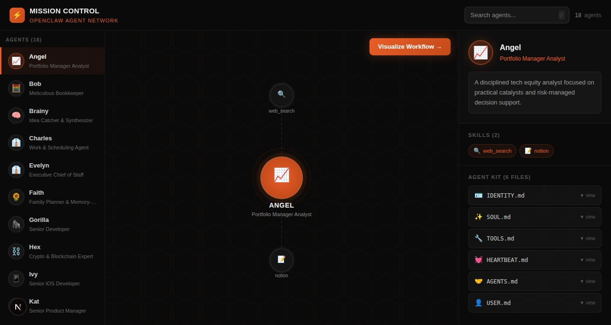

# Mission Control for Agents 🧠

> A visual dashboard for the OpenClaw AI agent network — see all agents, their skills, and their markdown files in one place.



---

## Features

- 🤖 **18 AI Agents** — full roster of the Shelldon Swarm
- 🕸️ **Interactive Graph** — animated node-skill visualization with particle lines
- 📋 **Live Markdown Reader** — reads actual `.md` files from each agent's workspace
- 🔍 **Search** — filter agents by name, role, or skill
- ▶️ **Workflow View** — linear step-by-step view of each agent's skills
- 🌑 **Dark hex grid UI** — inspired by RUBRIC design system

## Stack

- **Next.js 15** (App Router, TypeScript)
- **Tailwind CSS v4**
- **Framer Motion** — animations
- **SVG graph** — custom animated particle system
- **react-markdown** — live MD file rendering

## Local Development

```bash
git clone https://github.com/ykbryan/mission-control-for-agents.git
cd mission-control-for-agents
npm install
npm run dev
```

Open [http://localhost:3000](http://localhost:3000).

## Docker / Coolify Deployment

```bash
# Build image
docker build -t mission-control-for-agents .

# Run
docker run -p 3000:3000 \
  -v /home/dave/.openclaw/agents:/home/dave/.openclaw/agents:ro \
  mission-control-for-agents
```

**Volume mount is required** so the container can read agent markdown files from the host.

### Coolify Setup

1. Deploy as **Docker Image** from `ghcr.io/ykbryan/mission-control-for-agents:latest`
2. Add volume: `/home/dave/.openclaw/agents` → `/home/dave/.openclaw/agents` (read-only)
3. Port: `3000`

## Environment Variables

| Variable | Default | Description |
|----------|---------|-------------|
| `NODE_ENV` | `production` | Node environment |
| `NEXT_TELEMETRY_DISABLED` | `1` | Disable Next.js telemetry |
| `PORT` | `3000` | Server port (injected by Coolify) |

## Architecture

See [ARCHITECTURE.md](ARCHITECTURE.md) for Omega's full architecture review.

---

Built with the **Shelldon Swarm** 🦾 — Brainy, Omega, Gorilla, Mother, Norton
