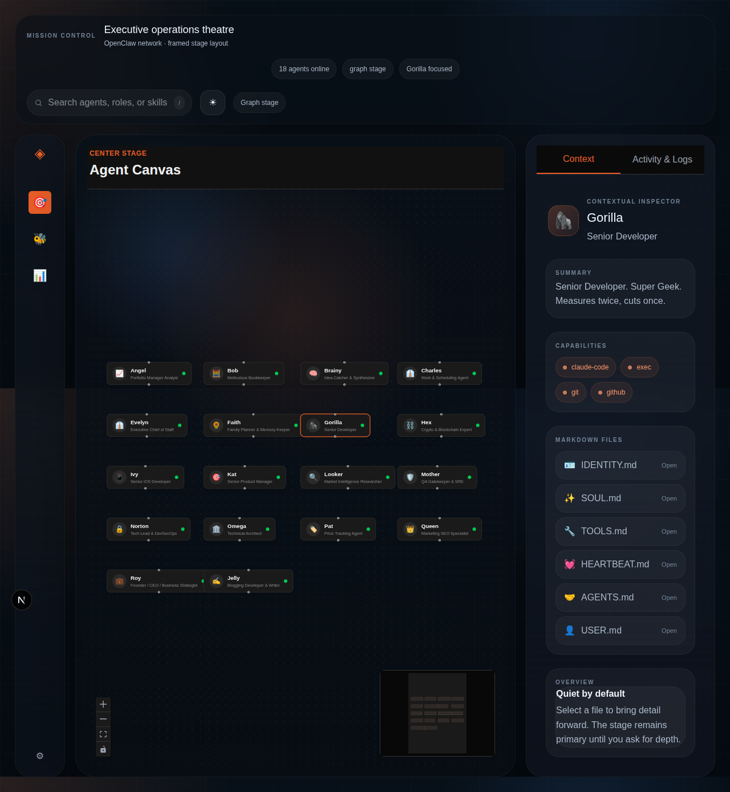

# Mission Control for Agents

> The spatial operating system for your OpenClaw agent swarms.



Mission Control is a Next.js dashboard for visualizing, navigating, and managing autonomous [OpenClaw](https://github.com/openclaw/openclaw) agent swarms. Connect multiple gateways at once — each one gets its own cluster on the canvas, with orchestrators and specialists laid out in hierarchy. The dashboard can be hosted anywhere; a lightweight **Router** bridges each OpenClaw instance over HTTP.

## Architecture

```
┌─────────────────────────┐         ┌──────────────────────────────┐
│   Your Machine (local)  │         │  Mission Control (anywhere)   │
│                         │  HTTP   │                               │
│  OpenClaw  ←→  Router ──┼─────────┼──→  Dashboard (Next.js)      │
│            (port 3010)  │         │         (port 3000)           │
└─────────────────────────┘         └──────────────────────────────┘
```

- **Router** runs on the same machine as OpenClaw. It bridges OpenClaw's localhost-only WebSocket and exposes a simple REST API.
- **Mission Control** (this app) can run anywhere. It connects to your router over HTTP using a token.

---

## Setup: One Router, One Mission Control

The simplest setup — everything on one machine.

### 1. Clone and install

```bash
git clone https://github.com/ykbryan/mission-control-for-agents.git
cd mission-control-for-agents
npm install
cd router && npm install && cd ..
```

### 2. Configure the router

```bash
cp router/.env.example router/.env
```

Edit `router/.env`:

```env
OPENCLAW_URL=http://127.0.0.1:18789   # your OpenClaw gateway URL
OPENCLAW_TOKEN=your_openclaw_token    # your OpenClaw bearer token
ROUTER_PORT=3010
```

### 3. Start both together

```bash
npm run dev:local
```

This starts the router (port 3010) and the dashboard (port 3000) simultaneously.

The router terminal will print its URL and token:

```
  🛰  Mission Control Router  v1.1.0

  Listening   http://localhost:3010
  OpenClaw    http://127.0.0.1:18789

  ────────────────────────────────────────
  In Mission Control, add this router:
  ────────────────────────────────────────

  Router URL  http://localhost:3010
  Token       abc123def456...
```

### 4. Log in

Open `http://localhost:3000`. Enter:
- **Router URL**: `http://localhost:3010`
- **Router Token**: the token printed above

---

## Setup: Multiple Routers, One Mission Control

Monitor several OpenClaw instances from a single hosted dashboard — useful if you run OpenClaw on multiple VPS machines or want a shared team dashboard.

```
┌──────────────────────┐
│  VPS A               │
│  OpenClaw ↔ Router A ├────────────┐
│  (port 3010)         │            │    ┌─────────────────────────┐
└──────────────────────┘            ├────┤  Mission Control        │
                                    │    │  (hosted anywhere)      │
┌──────────────────────┐            │    └─────────────────────────┘
│  VPS B               │            │
│  OpenClaw ↔ Router B ├────────────┘
│  (port 3010)         │
└──────────────────────┘
```

### On each machine running OpenClaw

**1. Copy just the router:**

```bash
# On VPS A
scp -r router/ user@vps-a:/opt/mission-control-router
ssh user@vps-a
cd /opt/mission-control-router
npm install
cp .env.example .env
# Edit .env with this machine's OPENCLAW_URL and OPENCLAW_TOKEN
npm start
```

Or clone the full repo and run just the router:

```bash
git clone https://github.com/ykbryan/mission-control-for-agents.git
cd mission-control-for-agents/router
npm install
cp .env.example .env
# Edit .env
npm start   # production
# or: npm run dev   # development with hot reload
```

**2. Note the router token** printed on startup. Each router generates its own unique token (saved to `.router-token`).

**3. Open port 3010** (or your chosen `ROUTER_PORT`) in the firewall so Mission Control can reach it.

> **Security tip:** Put the router behind a reverse proxy with HTTPS (e.g. Nginx + Let's Encrypt or Cloudflare Tunnel) before exposing it to the internet.

### Host Mission Control once

Deploy Mission Control anywhere — Vercel, Coolify, Render, your laptop:

```bash
npm run build
npm start
```

### Switch between routers

In the Mission Control dashboard, click **Disconnect** in the top bar, then log in again with the other router's URL and token. Each login stores the selected router's credentials in cookies, so you can switch at any time.

---

## Features

### Agent Canvas
Interactive node map built on React Flow. Zoom, pan, and click to inspect any agent.

### Agent Profile & Inspector
Double-click any node for an animated profile view showing the agent's identity, capabilities, and markdown files (SOUL.md, IDENTITY.md, SKILLS.md, etc.).

### Activity & Logs
Live activity stream built from the agent's session message history — user messages, model switches, tool calls, and responses.

### Token & Cost Analytics
Per-agent token consumption and estimated USD cost from session data.

---

## Router API Reference

The router exposes these endpoints (all require `Authorization: Bearer <token>` except `/health`):

| Endpoint | Description |
|---|---|
| `GET /health` | Health check (no auth) |
| `GET /agents` | List all agents from OpenClaw |
| `GET /sessions?agentId=` | List sessions for an agent |
| `GET /session?agentId=` | Get parsed activity events for latest session |
| `GET /file?agentId=&name=` | Get a markdown file for an agent |
| `GET /costs` | Token usage and cost estimates per agent |

---

## Environment Variables

### Router (`router/.env`)

| Variable | Default | Description |
|---|---|---|
| `OPENCLAW_URL` | `http://127.0.0.1:18789` | OpenClaw gateway URL |
| `OPENCLAW_TOKEN` | — | OpenClaw bearer token |
| `ROUTER_PORT` | `3010` | Port to listen on |
| `ROUTER_TOKEN` | auto-generated | Token for Mission Control auth |

The router auto-generates a `ROUTER_TOKEN` on first run and saves it to `.router-token`. Set `ROUTER_TOKEN` in `.env` to pin a specific value (useful for deployments).
